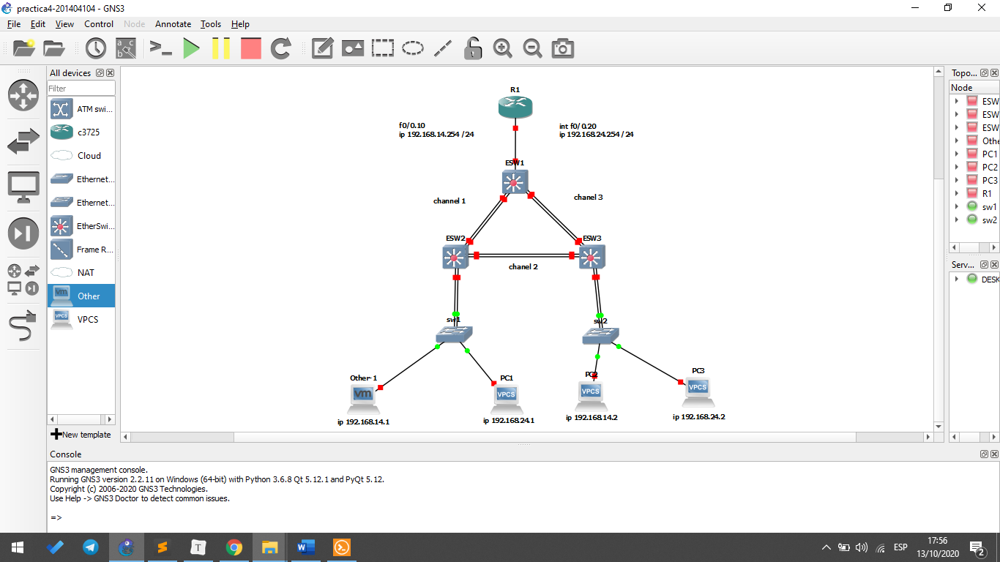
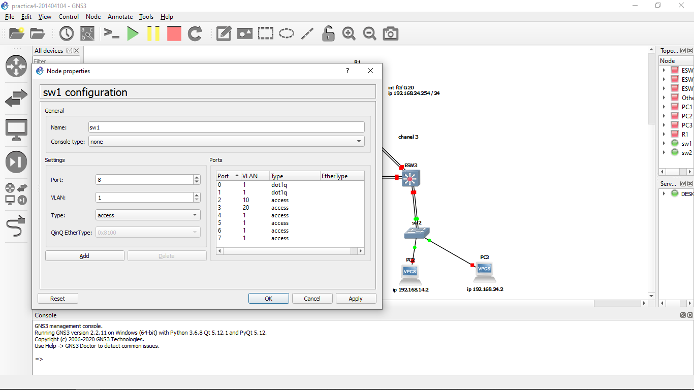
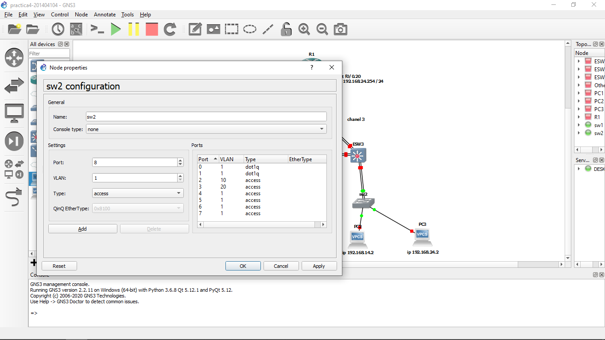
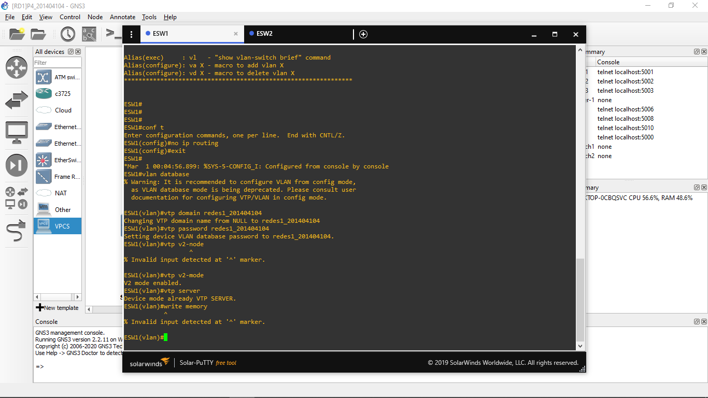
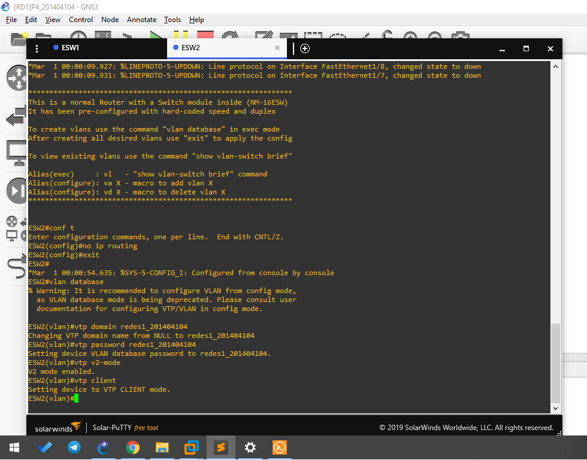
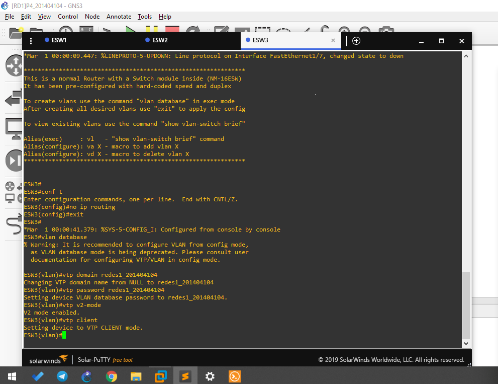
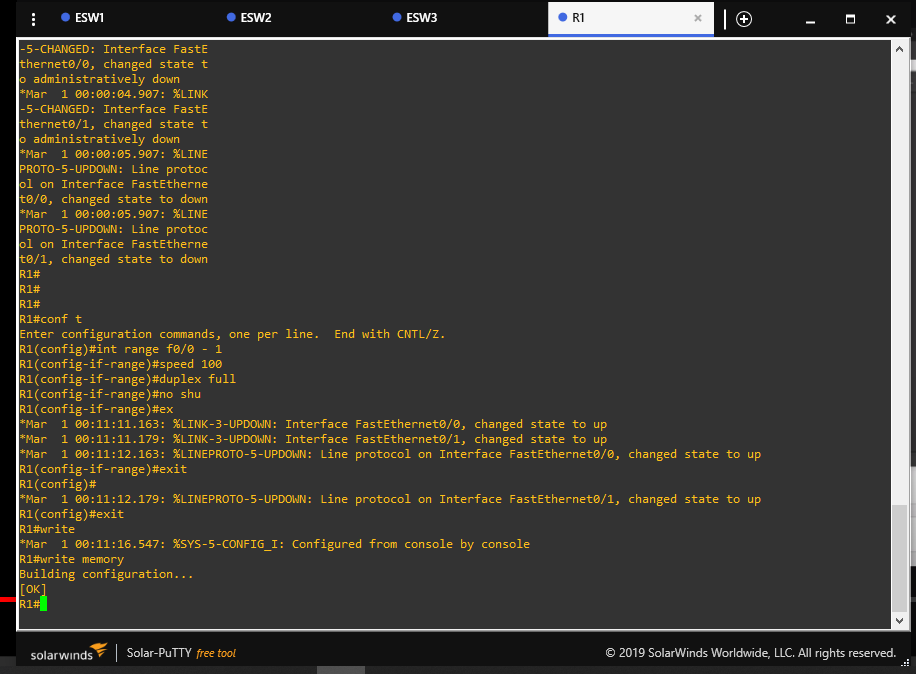
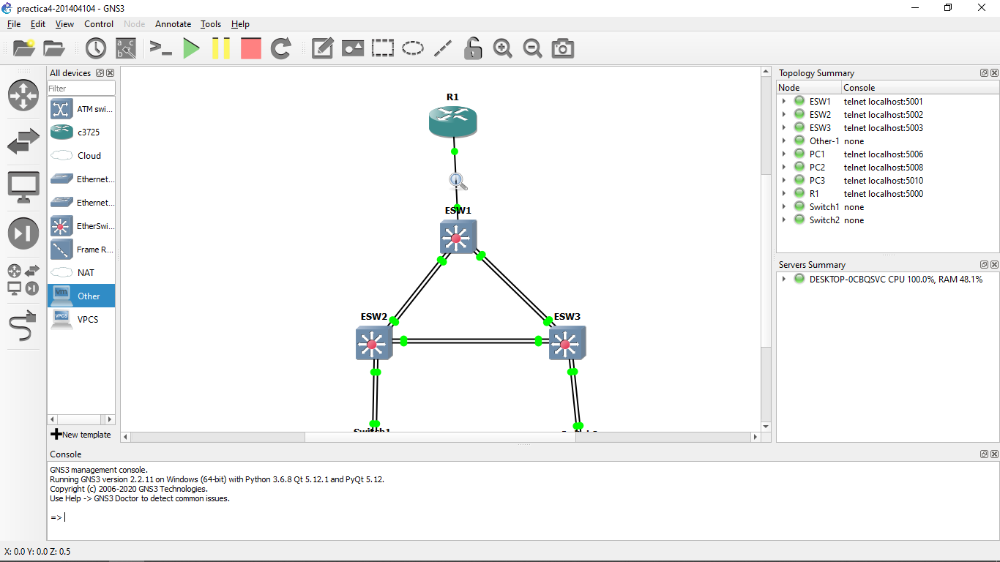
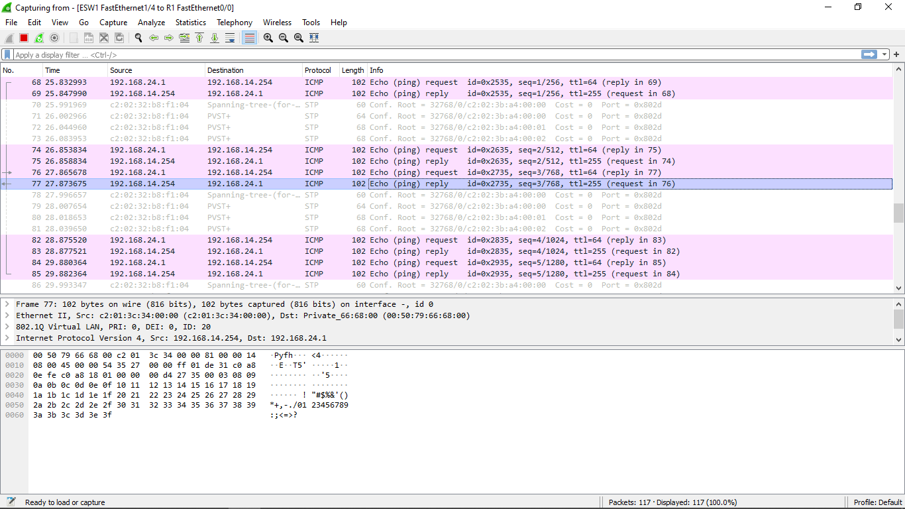

Andrea Nicte Vicente Campos

201404104


## Topología

- 1 Router c3725
- 3 Ethernet Switch
- 2 Switch
- 3 Vpc
- 1 VM




| PC              | Ip              |
| --------------- | --------------- |
| Other-1 (Linux) | 192.168.14.1/24 |
| PC1             | 192.168.24.1/24 |
| PC2             | 192.168.14.2/24 |
| PC3             | 192.168.24.2/24 |


## Configuración

###### Configurando velocidad del R1-Esw1-Esw2-Esw3

```
#para los esw
>configure terminal
#(esw | router)
>int range ( f1/0 - 15 | f0/0 - 1)
>speed 100
>duplex full
>no shutdown
```


###### Denigrando Esw1-Esw2-Esw3 a switch

```
>configure terminal

#quitando la opcion de ruteo
>no ip routing
>exit
```


###### Configuración VTP Esw1-Esw2-Esw3

- Configuración de vtp

```
#configurando vtp
>vlan database
>vtp domain redes1_201404104
>vtp password redes1_201404104
>vtp v2-mode

#esw1 sera server
#esw3 y esw2 seran client
>vtp (server | client)
```


###### Poniendo en modo trunk los esw

```
>configure terminal
>int range f1/0 - 15
>switchport mode trunk
```


###### Configurando las vlan en esw1 (va ser el server)

```
>vlan database
>vlan 10 name VENTAS
>vlan 20 name CONTA
```


###### Configurando los channel group de los esw

```
#Esw1
>configure terminal 
>int rang f1/0 - 1
>channel-group 1 mode on
>exit

>configure terminal 
>int rang f1/2 - 3
>channel-group 2 mode on
>exit

#Esw2
>configure terminal 
>int rang f1/0 - 1
>channel-group 1 mode on
>exit

>configure terminal 
>int rang f1/2 - 3
>channel-group 3 mode on
>exit

#Esw3
>configure terminal 
>int rang f1/0 - 1
>channel-group 2 mode on
>exit

>configure terminal 
>int rang f1/2 - 3
>channel-group 3 mode on
>exit
```


###### Configurando las vlan en el router

```
#Vlan 10
>configure terminal
>int f0/0.10
>encapsulation dot1q 10
>ip addres 192.168.14.254 255.255.255.0

#vlan 20
>configure terminal
>int f0/0.20
>encapsulation dot1q 20
>ip addres 192.168.24.254 255.255.255.0
```


###### Configurando swtichs 1,2








###### Configurando pc

```
#linux
>ip 192.168.14.1/24 192.168.14.254
>ping 192.168.14.254

#pc1
>ip 192.168.24.1/24 192.168.24.254
>ping 192.168.24.254

#pc2
>ip 192.168.14.2/24 192.168.14.254
>ping 192.168.14.254

#pc3
>ip 192.168.24.2/24 192.168.24.254
>ping 192.168.24.254
```

###### 

###### Al finalizar

```
#pc
>save

#esw y r1
>write memory
```


###### Screens de las configuraciones










## Captura de paquetes




